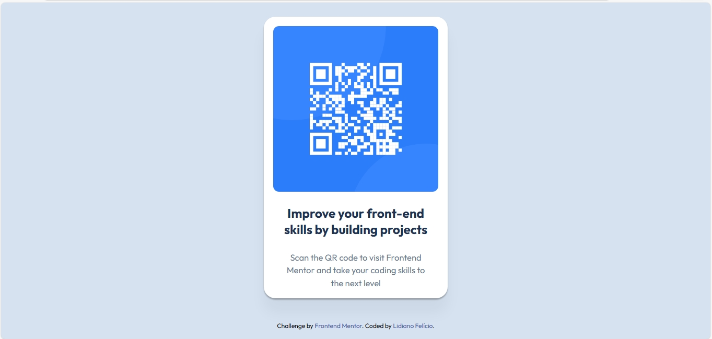

# Frontend Mentor - Componente QR Code

Esta é a minha solução para o desafio "QR code component" do Frontend Mentor.

## 📌 Visão Geral

Projeto simples desenvolvido com HTML e CSS, focado em centralização de layout e responsividade.

O objetivo foi reproduzir o design proposto o mais fiel possível.

## 📷 Screenshot

## 🔗 Links

- Repositório: https://github.com/lihsousa/qr-code-component
- Site publicado: 

## 🛠 Tecnologias utilizadas

- HTML5 semântico
- CSS
- Flexbox
- Mobile-first

## 📚 O que aprendi

- Centralização usando Flexbox
- Uso de min-height: 100vh
- Estruturação correta de layout responsivo

## 👨‍💻 Autor

- GitHub: https://github.com/lihsousa
- Frontend Mentor: https://www.frontendmentor.io/profile/lidianofeliciobr